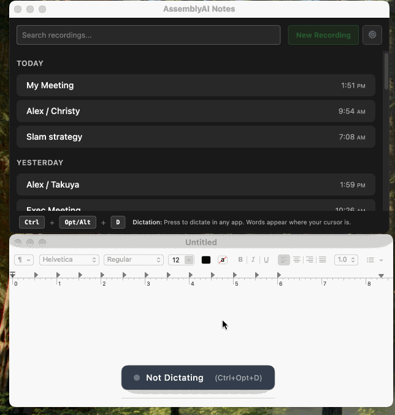

# Assembly Notes

Real-time meeting transcription and AI summaries for macOS, Windows, and Linux.

[](https://github.com/alexkroman/assembly-notes/releases/latest)
[](https://opensource.org/licenses/MIT)


_Record meetings with real-time transcription and AI summaries_



_Voice-to-text dictation with custom prompts_

## Features

**Meetings**

- Record microphone and system audio together
- Live transcription with AssemblyAI
- AI summaries via AssemblyAI
- Post to Slack

**Dictation**

- Voice-to-text with custom prompts
- Smart formatting

## Download

| Platform              | Download                                                                                                      |
| --------------------- | ------------------------------------------------------------------------------------------------------------- |
| macOS (Apple Silicon) | [DMG](https://github.com/alexkroman/assembly-notes/releases/latest/download/Assembly-Notes-mac-arm64.dmg)     |
| macOS (Intel)         | [DMG](https://github.com/alexkroman/assembly-notes/releases/latest/download/Assembly-Notes-mac-x64.dmg)       |
| Windows               | [Installer](https://github.com/alexkroman/assembly-notes/releases/latest/download/Assembly-Notes-win-x64.exe) |
| Ubuntu/Debian (x64)   | [DEB](https://github.com/alexkroman/assembly-notes/releases/latest/download/Assembly-Notes-linux-x64.deb)     |
| Ubuntu/Debian (ARM64) | [DEB](https://github.com/alexkroman/assembly-notes/releases/latest/download/Assembly-Notes-linux-arm64.deb)   |

Other Linux: Use [AppImage](https://github.com/alexkroman/assembly-notes/releases/latest)

## Quick Start

1. Download and install
2. Add your [AssemblyAI API key](https://www.assemblyai.com/) in Settings
3. (Optional) Connect Slack for auto-posting
4. Start recording or dictating

### Development

```bash
git clone https://github.com/alexkroman/assembly-notes.git
cd assembly-notes
npm install
npm start
```

## Configuration

### AssemblyAI (Required)

1. Get a free API key at [assemblyai.com](https://www.assemblyai.com/)
2. Add it in Settings

### Slack (Optional)

1. Create a Slack app using [`slack-app-manifest.json`](./slack-app-manifest.json)
2. Add Client ID and Secret in Settings
3. Connect and choose channels

[See detailed setup →](#slack-setup)

## Development

**Requirements:** Node.js 24+, npm 10+

### Commands

```bash
# Development
npm start              # Start app
npm run dev            # Start with hot reload
npm test               # Run tests

# Build
npm run build:mac      # macOS
npm run build:win      # Windows
npm run build:linux    # Linux

# Code quality
npm run lint           # Check code
npm run format         # Format code
npm run typecheck      # Type check
```

### Tech Stack

- Electron + TypeScript + React
- AssemblyAI SDK for transcription
- SQLite for local storage
- Redux for state management

## Slack Setup

<details>
<summary>Detailed instructions</summary>

1. **Create Slack app**
   - Go to [api.slack.com/apps](https://api.slack.com/apps)
   - Create from manifest using [`slack-app-manifest.json`](./slack-app-manifest.json)

2. **Get credentials**
   - Copy Client ID and Secret from Basic Information

3. **Connect**
   - Add credentials in Assembly Notes Settings
   - Click Connect to Slack
   - Authorize and select channels

**Private channels:** Invite bot with `/invite @assembly-notes`  
**DMs:** Select any user, no invite needed

</details>

## Contributing

1. Fork the repo
2. Create a branch (`git checkout -b feature/name`)
3. Make changes
4. Run tests (`npm test`)
5. Commit (`git commit -m 'Add feature'`)
6. Push and open a PR

## License

MIT - see [LICENSE](LICENSE)
