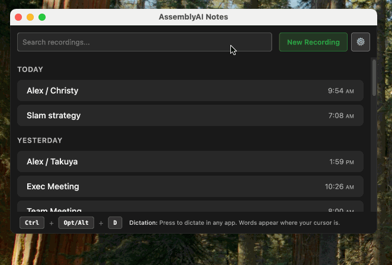

# Assembly Notes


[](https://github.com/alexkroman/assembly-notes/releases/latest)
[](https://opensource.org/licenses/MIT)
[](https://github.com/alexkroman/assembly-notes/releases/latest)

**Real-time meeting transcription and AI-powered summaries.** Capture both microphone and system audio, transcribe with AssemblyAI, and automatically post intelligent summaries to Slack.

## ✨ Key Features

- 🎤 **Dual Audio Capture** - Records microphone and system audio simultaneously
- ⚡ **Real-time Transcription** - Live speech-to-text with AssemblyAI's advanced models
- 🤖 **AI Summaries** - Claude-powered meeting summaries via AssemblyAI Lemur
- 📱 **Slack Integration** - Automatic posting to channels or direct messages
- 🔄 **Cross-platform** - Native apps for macOS, Windows, and Linux
- 💾 **Local Storage** - All recordings and transcriptions stored locally
- 🎯 **Smart Prompts** - Customizable AI prompts for tailored summaries

## 📥 Download

Download the latest version for your platform:

| Platform                  | Download                                                                                                                          |
| ------------------------- | --------------------------------------------------------------------------------------------------------------------------------- |
| **macOS** (Apple Silicon) | [Download DMG](https://github.com/alexkroman/assembly-notes/releases/latest/download/Assembly-Notes-mac-arm64.dmg)                |
| **macOS** (Intel)         | [Download DMG](https://github.com/alexkroman/assembly-notes/releases/latest/download/Assembly-Notes-mac-x64.dmg)                  |
| **Windows**               | [Download Installer](https://github.com/alexkroman/assembly-notes/releases/latest/download/Assembly-Notes-win-x64.exe)            |
| **Ubuntu/Debian** (x64)   | [DEB Package](https://github.com/alexkroman/assembly-notes/releases/latest/download/Assembly-Notes-linux-x64.deb) (Recommended)   |
| **Ubuntu/Debian** (ARM64) | [DEB Package](https://github.com/alexkroman/assembly-notes/releases/latest/download/Assembly-Notes-linux-arm64.deb) (Recommended) |
| **Other Linux** (x64)     | [AppImage](https://github.com/alexkroman/assembly-notes/releases/latest/download/Assembly-Notes-linux-x64.AppImage)               |
| **Other Linux** (ARM64)   | [AppImage](https://github.com/alexkroman/assembly-notes/releases/latest/download/Assembly-Notes-linux-arm64.AppImage)             |

## 🚀 Quick Start

### For End Users

1. **Download** the app for your platform from the table above
2. **Install**:
   - **Ubuntu/Debian**: `sudo dpkg -i Assembly-Notes-linux-*.deb`
   - **macOS**: Open the DMG and drag to Applications
   - **Windows**: Run the installer
   - **Other Linux**: Make AppImage executable with `chmod +x` and run
3. **Configure** your AssemblyAI API key in Settings
4. **Optional**: Set up Slack integration for automatic posting
5. **Start Recording** to begin transcribing your meetings!

### For Developers

```bash
# Clone the repository
git clone https://github.com/alexkroman/assembly-notes.git
cd assembly-notes

# Install dependencies
npm install

# Start in development mode
npm start
```

## 🔧 Configuration

### Required: AssemblyAI API Key

Assembly Notes uses AssemblyAI for high-quality transcription and AI summarization:

1. Sign up for a free account at [assemblyai.com](https://www.assemblyai.com/)
2. Get your API key from the dashboard
3. Add the key in Assembly Notes Settings

> 💡 **Free Tier**: AssemblyAI offers free transcription credits for new users.

### Optional: Slack Integration

Automatically post meeting summaries to your Slack workspace:

1. Create a Slack app using our [manifest](./slack-app-manifest.json)
2. Get your Client ID and Secret from Slack
3. Enter credentials in Assembly Notes Settings
4. Click "Connect to Slack"
5. Choose channels for posting summaries

📖 **[Detailed Slack setup guide →](#slack-integration-setup)**

## 🛠️ Development

### Available Commands

```bash
# Development
npm start              # Start the app
npm run dev            # Start with hot reload
npm run test           # Run all tests
npm run test:watch     # Run tests in watch mode
npm run test:e2e       # Run end-to-end tests

# Building
npm run build:mac        # Build for macOS
npm run build:win        # Build for Windows
npm run build:linux       # Build for Linux x64 (AppImage + DEB)
npm run build:linux:x64   # Build for Linux x64 (AppImage + DEB)
npm run build:linux:arm64 # Build for Linux ARM64 (AppImage + DEB)
npm run build:all        # Build for all platforms

# Releases
npm run release:patch  # Bug fixes (1.0.0 → 1.0.1)
npm run release:minor  # New features (1.0.0 → 1.1.0)
npm run release:major  # Breaking changes (1.0.0 → 2.0.0)
```

### Tech Stack

- **Electron 37.2.4** - Cross-platform desktop framework
- **TypeScript 5.8.3** - Type-safe JavaScript development
- **React 19.1.1** - Modern UI components
- **AssemblyAI SDK** - Professional transcription service
- **SQLite** - Local data storage
- **Redux Toolkit** - State management
- **Tailwind CSS** - Utility-first styling

## 📋 Slack Integration Setup

<details>
<summary>📖 Click for detailed setup instructions</summary>

### Step 1: Create Slack App

1. Navigate to [api.slack.com/apps](https://api.slack.com/apps)
2. Click "Create New App" → "From an app manifest"
3. Select your workspace
4. Copy the contents of [`slack-app-manifest.json`](./slack-app-manifest.json)
5. Paste the manifest and create the app

### Step 2: Get Credentials

1. Go to "Basic Information" in your Slack app
2. Locate your **Client ID** and **Client Secret**
3. Copy both values for use in Assembly Notes

### Step 3: Connect Assembly Notes

1. Open Assembly Notes and go to Settings
2. Enter your Slack credentials (Client ID and Secret)
3. Click "Connect to Slack"
4. Authorize the app in your browser
5. Select channels for automatic summary posting

### Using Private Channels & DMs

**Private Channels:**

- Invite the bot: `/invite @assembly-notes`
- Refresh the channels list in settings

**Direct Messages:**

- Select any user as the destination
- No invitation required

</details>

## 🤝 Contributing

We welcome contributions! Here's how to get started:

1. **Fork** the repository
2. **Create** a feature branch (`git checkout -b feature/amazing-feature`)
3. **Make** your changes
4. **Test** your changes with `npm test`
5. **Commit** your changes (`git commit -m 'Add amazing feature'`)
6. **Push** to the branch (`git push origin feature/amazing-feature`)
7. **Open** a Pull Request

### Development Guidelines

- Follow the existing code style and TypeScript conventions
- Add tests for new features
- Update documentation as needed
- Ensure all tests pass before submitting

## 📄 License

This project is licensed under the MIT License - see the [LICENSE](LICENSE) file for details.
